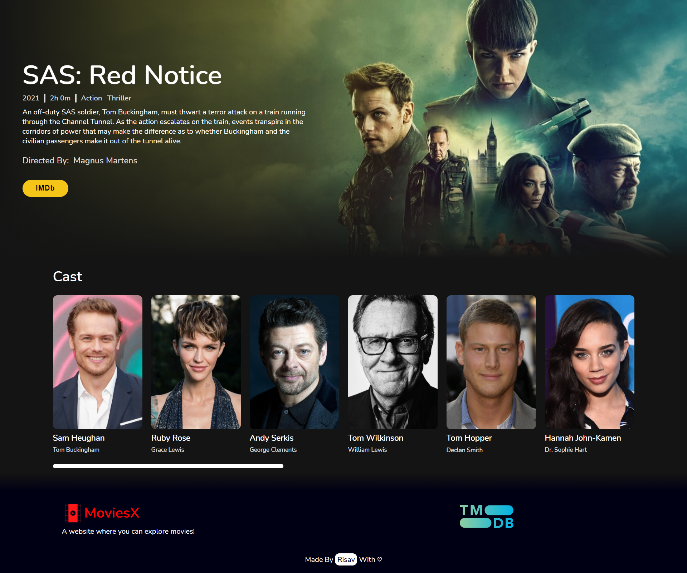

<h1 align="center">MoviesX</h1>

> <p align="center">A website where you can explore movies!<p>


<p align="center">Sample Movie Page</p>

## ✨ About

MoviesX is a website where one can view popular and upcoming movies. It also has a movie search functionality and one can view cast, directors etc of respective movies. It has a good frontend design and responsive for mobile devices. The website is built using React.js and hosted in Netlify. The data is fetched from [TMDB](https://www.themoviedb.org/).

## 🚀 Usage

The website is hosted in Netlify. [Click here to Visit](https://moviesx.netlify.app/)

<br>

To run locally make sure you have NPM installed.

Just run the following command at the root of the project:

Install Dependencies

```sh
npm install
```

Run the app

```sh
npm start
```
